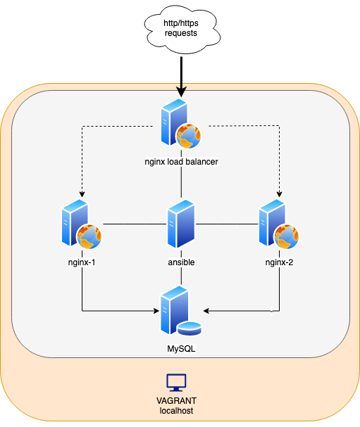
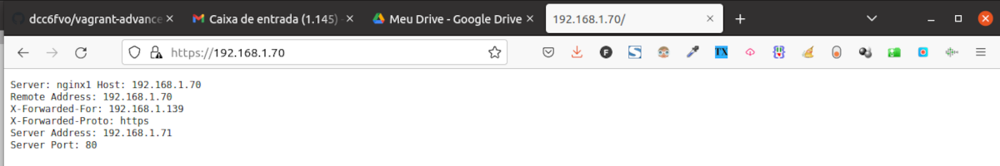
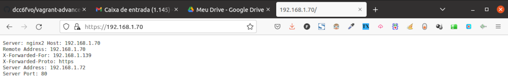
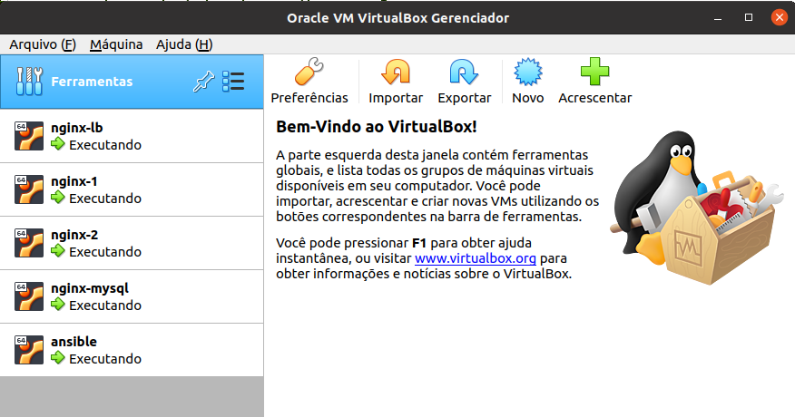

# vagrant-virtualbox-advanced-with-loadbalancer

This is a more 'real world' example of vagrant configuration with virtualbox that provides 05 virtual machines: one nginx load balancer with https, two nginx http servers, a MySQL database and finally, the management machine with ansible software. Don't forget to create/use another SSH private key. The image below synthesizes the architecture:

  

First things first!
-----------------------
1) Change the pub and private keys for ansible <> vms ssh access (/id_rsa, /id_rsa.pub, Vagrantfile);
2) Change the virtual machines network configuration if needed. Currently configured IPs are 192.168.1.70, 192.168.1.71, 192.168.1.72, 192.168.1.73, and ansible with dhcp as your taste (take a look at Vagrantfile). 
3) Change default ansible variables located at configs/group_vars if needed.
4) Change ansible host configuration at /hosts file if required.
5) Configure your SSL certificate for the load balancer instead of auto generating one (/configs/roles/load-balance/tasks/main.yml)

Prerequisites
-----------------------
Vagrant and virtualbox are both essential and can be easily installed on ubuntu/debian like distro:

	sudo apt-get install virtualbox && sudo apt-get install vagrant
   
Installation && Running
-----------------------

Do a git clone of the project:

	git clone https://github.com/dcc6fvo/vagrant-advanced

Access the newly created folder with the git clone command and type the following command:

	vagrant up

To forcible destroy all the configurations:

	vagrant detroy -f
  
Finally
-----------------------

If everything goes normally you should be able to access nginx web server 1 (nginx-1) and nginx web server 2 (nginx-2) through nginx load balancer as as shown in the figures below:

  

  

Virtualbox should look like:

  

  
